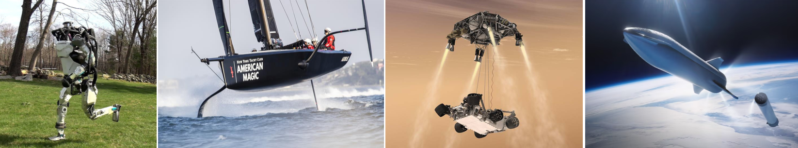

<!-- Markdown comments are html ones -->

# Multibody System Dynamics #

Course edition: 2023 - 2024

[Master's Degree in Mechanical Engineering](https://eseiaat.upc.edu/ca/estudis/estudis-en-enginyeries-industrials/master-universitari-recerca-enginyeria-mecanica)  
[Mechanical Engineering Department](https://em.upc.edu/ca), [UPC-BarcelonaTech](http://www.upc.edu)

This course explores the modelling and simulation of multibody systems composed of rigid bodies. On completion of the course, students should be able to model a multibody system and perform kinematic and dynamic analyses by means of computational simulation methods. The course also emphasizes connections to control theory by means of lab exercises that guide students from building a system's dynamic model to designing a control law to track a given trajectory.
## Table of Contents

+ [Course data](#course-data)  
+ [Methodology](#methodology)  
+ [Grading](#grading)  
+ [Calendar](#calendar)  
+ [Course material](#course-material)  
    - [U0 - Introduction](#u0---introduction)  
    - [U1 - Rigid body kinematics](#u1---rigid-body-kinematics)  
    - [U2 - Rigid body dynamics](#u2---rigid-body-dynamics)  
    - [U3 - Intro to multibody system kinematics](#u3---introduction-to-multibody-system-kinematics)  
    - [U4 - Lagrange equations](#u4---lagrange-equations)  
+ [Lab assignments](#lab-assignments) 
    - [Lab 1 - Simulation of a driven pendulum](#lab-1-simulation-of-a-driven-pendulum)
    - [Lab 2 - Simulation of an acrobot](#lab-2-simulation-of-an-acrobot)
    - [Lab 3 - Control of a Scara robot](#lab-3-control-of-a-scara-robot)
+ [Final exam](#final-exam)  
+ [Help](#help)  
+ [Bibliography](#bibliography)  

## Course data

+ **Prerequisites:** 
    Ideally, students should have knowledge on rigid body kinematics and dynamics (the one imparted in the ["Mechanics"](https://www.upc.edu/content/grau/guiadocent/pdf/ing/240133) course from ETSEIB). However, these topics will be introduced as needed so as to build up the Lagrange formulation. Students should also be familiar with MATLAB and have an English level allowing them to understand textbooks and oral presentations.
+ **Academic year:** 
    2023-2024
+ **Semester:** 
    February-May.
+ **ECTS Credits:** 
    3.
+ **Teaching language:** 
    Catalan (Spanish or English if needed). 
+ **Teachers:**
    [Lluís Ros](http://www.iri.upc.edu/people/ros) (instructor) and [Rosa Pàmies-Vilà](https://scholar.google.es/citations?user=76A5wa0AAAAJ&hl=ca) (coordinator).
+ **Previous teachers:** 
    Albert Peiret, Josep M. Font.
+ **Classroom:**
    The last two sessions will be in H-0.1. Previously we met in G.1 for theory sessions ([how to get there](Web/way_to_G1.pdf)) and in Pavelló E, upper floor for lab sessions. 
+ **Schedule:** 
    Wednesday 17:00 - 19:00.
+ **Start date:** 
    21 march.
+ **Consultation hours:** 
    Each Wednesday after class, but please email the teacher to arrange them beforehand.

## Methodology

The subject will be worked out in theory and problem sessions, and by means of lab sessions with personal computers. Please install Matlab in your laptop  (instructions below), and be ready to bring it to class with enough battery.

Theory slides and their notes will be published before each class so the student can print them for annotation. 

Depending on the course evolution, seminar sessions might be programmed as well. In them the active participation of the assistants is fundamental, and the teacher's task is, essentially, to present and set the topics in context and coordinate the discussion among participants.

## Grading

Global course grade NFIN will be based on the following partial grades: 

+ NLAB = Lab assignments grade (0 to 10)
+ NEXAM = Final exam grade (0 to 10)

The final mark will be 

+ NFIN = 0.5 NLAB + 0.5 NEXAM

A student will pass the course if NFIN ≥ 5.

Clarity of presentation is a must. Poorly presented answers or reports may reduce the score up to 30% of the maximum one achievable.

## Calendar

Here's a [calendar for the course](https://drive.google.com/file/d/1_UOKDJ5CSPfCxRHi9gRKcGjxq3iE7uBM/view?usp=sharing). We may change it on the fly depending on the course evolution. Any changes will be announced.

## Course material

This section provides the whole teaching material, including theory and exercises.

### U0 - Introduction 

+ [Slides](https://drive.google.com/file/d/1b4BbhhQkKRdTGpxlVsQ8TgnisiEfvOut/view?usp=sharing)
+ [Slides with notes](https://drive.google.com/file/d/1b1GDBQu6GRLSKqMuKRif1xW2rUaeWwJs/view?usp=sharing)
+ [Pendulum example](https://drive.google.com/file/d/1b54Vnr8G4x4veTDPuBvy-84ZApgG_EX_/view?usp=sharing)

After studying the previous material, you can proceed to the Lab1 assignment.

For those needing more background on numerical methods to solve ODEs you can read [this document](https://drive.google.com/file/d/1SYKWiDIoc1VbC7QMvKZBYHuvU87VVqre/view). From the beginning to the trapezoidal rule is sufficient (but knowledge of the Runge-Kutta methods is useful in engineering).

### U1 - Rigid body kinematics 

+ [Slides](https://drive.google.com/file/d/1c-APkt4uQUM5e1Koo8dTzz4QeVcGT9Nv/view?usp=sharing)  
+ [Slides notes](https://drive.google.com/file/d/1c34hxWwVfWtkvmRCWWhyNatn2FifGY42/view?usp=sharing)  

### U2 - Rigid body dynamics 

+ [Slides](https://drive.google.com/file/d/1eLVOFpR2I5_gpzI3iOJcXdnWKpfFPx8W/view?usp=sharing)
+ [Slides with notes](https://drive.google.com/file/d/1eEHJE4ecd7QmobfFYy9BSBm-JqiwpHqk/view?usp=sharing)
+ [Exercise solutions](https://drive.google.com/file/d/1eLLMX0aIMiQdPxZUrs7sXVGm2XlyXZoL/view?usp=sharing)
+ [Table of centers and moments of intertia](https://drive.google.com/file/d/1atoFsKr-c-lcxlYE70wk_-2_LIdXLrG4/view?usp=sharing)

### U3 - Introduction to multibody system kinematics

+ [Notes](https://drive.google.com/file/d/1-kVIUoQavpVoM8O6r6OmTSCve1jEzA5K/view?usp=sharing)

### U4 - Lagrange equations

+ [Notes](https://drive.google.com/file/d/1-g-H9_PerbZn2hCBvFlLY1nkIdsDvRUL/view?usp=sharing)
+ [Exercises](https://drive.google.com/file/d/1-ueQJqWUp_SU5EmURT5r0KMLCJ7h3GgT/view?usp=sharing)
+ [Exercise solutions](https://drive.google.com/file/d/1K57mBQitvGC0WljCDgqERO8rYKuXGxLl/view?usp=sharing)

## Lab assignments

In each lab practice we provide you with the Latex source of the assignment as a zip file. This facilitates the preparation of your lab report using [Overleaf](http://www.overleaf.com) if you want. Just go to 

    http://www.overleaf.com > "New project" > "Upload project"
    
and drag and drop your zip file there!

### Lab 1: Simulation of a driven pendulum

+ [Assignment and files](https://drive.google.com/drive/folders/1YFzyJ-1Y0UuMf3V7O2sOcT2KzeOoNMh3?usp=sharing).

Preparation for this practice: Study the theory of Unit 0 before attempting to solve this lab practice. Also understand the practice assignment and the program pendulum.m in detail. The following videos may be of help:

+ [Video introduction to the practice](https://youtu.be/UEq85MuaQZk)
+ [Introduction to the Matlab debugger](https://youtu.be/rp2CoVkxP5U)

### Lab 2: Simulation of an acrobot

+ [Assignment and files](https://drive.google.com/drive/folders/1YP_XIk5oGVZSqWlIuug6nQAVaP8QUOWo?usp=sharing)

Preparation for this practice: Read the [practice assignment](https://drive.google.com/file/d/1ahxe6OTarUs1ulb3tBP7YjZym1r3PafK/view?usp=sharing) and the document ["Preparation for Lab practice 2"](https://drive.google.com/file/d/1gGNUanaKoBRui1Vj6iImLrez7y0r_SXB/view?usp=sharing). The latter gives a piece of theory needed to understand the concepts of mass matrix, Coriolis matrix, and gravity term. You will also need to understand the theory of Units 1 and 2 regarding the formulation of velocities and kinetic/potential energies. After that, proceed to solve the practice assignment. You'll need to have the symbolic math toolbox of Matlab installed in your laptop. Type "ver" in the Matlab command window. If the toolbox is listed, it means you already have it installed.

Update: we have finally devoted two sessions to this practice, and I've given you this material:

+ [Blackboards of the 1st Lab2 session](https://photos.app.goo.gl/GEsLwjcobkYvRwMz8). 
+ [Flow diagram of model.mlx and acrobot.m](https://drive.google.com/file/d/1-yn2_Dlt_3OLeLmFn-jGvvWJpHN7364O/view?usp=sharing).
+ [Help for points (I) and (J)](https://drive.google.com/file/d/10QdC15dFmsOmucjggjpdBMK4f8ZRR0si/view?usp=sharing).

Curiosities: motivated by a question by Weike Liao, here's an [animation that shows the effect of chaos on a triple pendulum](https://youtu.be/0vkV5AduqOw?si=1CQmCLX1UNtpCMVA). It shows the simulation of many triple pendula whose initial conditions are almost the same (they just differ slightly). Initially the motions coincide, but soon they diverge because of chaos (high sensitivity of the evolution of the system to its initial conditions). A similar effect arises in the double pendulum of this practice and could be reproduced by applying some edits in acrobot.m. Despite chaos arises in many systems, the time it manifests itself is very variable. For example, the solar system is chaotic, but for reasonably close initial conditions its simulations almost coincide during time horizons of millions of years.

### Lab 3: Control of a Scara robot

+ [Assignment and files](https://drive.google.com/drive/folders/1YPfvxIEOYPocA-jCeJA1ksDYjwy7MPYS?usp=sharing).
+ [Video introduction to the practice](https://youtu.be/Q8RaUn2DRwg).
+ [Summary of howto_ctc.pdf](https://drive.google.com/file/d/1JTuLhEy1dhGNt_c2pHYDa0DG7v47NQwD/view?usp=sharing).

## Final exam

The final exam took place on Friday 14 June 15:00-18:30 in room L-LS.4.

Here's the [exam](https://drive.google.com/file/d/1OVS7GM2BN5OO4-kB1tpdByNMwYSKyLHW/view?usp=sharing) (in Catalan and Spanish) and its [solution](https://drive.google.com/file/d/1ORVI_VK8NwuScKl76cEPGjkqVTYTNQFY/view?usp=sharing) (in English).

### What you can/cannot bring

You can bring:

* Any printed or handwritten material you want, in paper.
* A scientific calculator.
* Ball pen, pencil, and rubber.

You cannot bring any device with the ability to communicate with others. In particular, cell phones must be shut down during the exam. Computers will not be allowed as a substitute of a scientific calculator.

### Priority topics

+ **Unit 0**: The whole unit, and in special: the concept of state, how to transform a 2nd order ODE into a 1st order one, numerical integration through Euler's method, and the concept of initial value problem and its geometric interpretation.

+ **Unit 1**: The whole unit with an emphasis on velocities, and less on accelerations. You have to master: the formulation of velocities of points by any means (taking derivatives of position vectors in fixed or moving bases, and using composition or propagation of velocities), the formulation of angular velocities, the concept of instantaneous center of rotation and how to formulate velocities of other points using such a center.

+ **Unit 2**: Moment of inertia. Steiner's theorem. How to formulate spring and damper forces. How to express the kinetic and potential energy functions of a multibody system in terms of q and qdot (potential energy may be due to gravity and spring forces). How to compute the attractive/repulsive force of a spring in an equilibrium configuration of your multibody system (this may require the application of statics conditions on bodies of your system, so you may need to identify constraint forces/torques transmitted through joints).

+ **Unit 3**: Distinction between constrained and unconstrained system. You must know which kind of Lagrange equation applies to each type of system (ordinary or with multipliers).

+ **Unit 4**: You should know how to formulate Lagrange's equation for systems with or without nonconservative forces. How to formulate the generalized force F_nc^* (right hand side of Lagrange's equation). Also how to rewrite Lagrange's equation in the standard form M·qdd + C·qd + G = F_nc^* and how to convert this equation into a 1st order ODE (to have it prepared to solve initial value problems).

+ **Lab practices:** all concepts of the practices may be subject to evaluation, but a computer will not be needed. We will not ask you to implement any Matlab program.

## Help

### Vocabulary table

We list the concepts in order of appearance in the course:

| English      | Catalan       | Spanish         |
| :---         | :---          | :---            |
| Revolute joint | Enllaç de revolució | Enlace de revolución o articulación de rotación | 
| Reference frame | Referència | Referencia |
| Coordinate system | Sistema de coordenades | Sistema de coordenadas |
| Trihedral | Tríedre | Trihedro |
| Pose (position+orientation)| Posa (posició+orientació)| Pose (posición+orientación) |
| Skew symmetric matrix | Matriu antisimètrica | Matriz antisimétrica |
| Transportation velocity | Velocitat d'arrossegament | Velocidad de arrastre |
| Transportation acceleration | Acceleració d'arrossegament | Aceleración de arrastre |
| Sliding | Lliscament | Deslizamiento |
| Instantaneous axis of rotation | Eix instantani de rotació | Eje instantáneo de rotación |
| Torque (or couple) | Parell | Par |
| Moment | Moment | Momento |
| Constraint force | Força d'enllaç | Fuerza de enlace |
| Wrench | Torsor de forces | Torsor de fuerzas |
| Spring | Molla | Muelle |
| Damper | Amortidor | Amortiguador |
| Linear momentum | Quantitat de moviment | Cantidad de movimiento |
| Angular momentum | Moment cinètic (o angular) | Momento cinético (o angular) |

### How to install MATLAB

If you have specific instructions given to you by UPC, please follow them.

Otherwise, try the UPC instructions in [this page](https://drive.google.com/file/d/1b5r1ywgKq_68sCblAXKI5Wj7fIqg4mc5/view?usp=sharing). The web portal they refer to is [this one](https://www.mathworks.com/academia/tah-portal/politecnica-de-catalunya-31113606.html).

You will need the login credentials of the Mathworks account associated with your university license. In principle, they coincide with those you use to access the UPC intranet.

We recommend to install all toolboxes available.

## Bibliography

### On rigid body mechanics

A helpful web is (connection is safe):

* [https://mec.etseib.upc.edu](https://mec.etseib.upc.edu) (Catalan version)
* [https://mec.etseib.upc.edu/en](https://mec.etseib.upc.edu/en) (English version)

The course books of reference are:

* J. Agulló i Batlle, A. Barjau Condomines, [Rigid body kinematics](https://discovery.upc.edu/discovery/fulldisplay?docid=alma991001807209706711&context=L&vid=34CSUC_UPC:VU1&lang=ca&search_scope=MyInst_and_CI&adaptor=Local%20Search%20Engine&tab=Everything&query=any,contains,rigid%20body%20kinematics), Cambridge University Press, 2020.  
* J. Agulló i Batlle, A. Barjau Condomines, [Rigid body Dynamics](https://discovery.upc.edu/discovery/fulldisplay?docid=alma991005056379406711&context=L&vid=34CSUC_UPC:VU1&lang=ca&search_scope=MyInst_and_CI&adaptor=Local%20Search%20Engine&tab=Everything&query=any,contains,rigid%20body%20dynamics&offset=0), Cambridge University Press, 2022.

Catalan versions of these books are:

* J. Agulló i Batlle, [Mecànica de la partícula i del sòlid rígid](https://drive.google.com/file/d/1uPpVqWN7lk8mjyxJLJoOftuXIhwUzYuK/view), Publicacions OK punt, 2002.  
* J. Agulló i Batlle, [Introducció a la mecánica analítica, percussiva i vibratòria](https://drive.google.com/file/d/0B8D7-40pC_acVUxUMlNzZ21FckU/view?resourcekey=0-gN4xCz7gEEu1Yo0uAiZuPA), Publicacions OK punt, 1998. Link.

Further material is available in [Prof. Agulló's page](https://www.agullobatlle.cat/activitat-docent), including Spanish versions of the books and collections of solved exercises.

### On Matlab

An excellent book introducing Matlab is Higham:

* D. J. Higham and N. J. Higham. [Matlab Guide](https://books.google.co.vi/books?id=zM_ZDQAAQBAJ&printsec=copyright#v=onepage&q&f=false) (3rd edition). SIAM 2017.

A [MATLAB cheat sheet](https://drive.google.com/file/d/1asNkwxljhMEJbTn1l7ZfwfFqIns37jPN/view?usp=sharing) from MIT.

[Trick: expand all or collapse all in Matlab file.](https://www.mathworks.com/help/matlab/matlab_prog/edit-and-format-code.html#:~:text=To%20expand%20or%20collapse%20all,%2C%20(comma)%20keyboard%20shortcuts)

